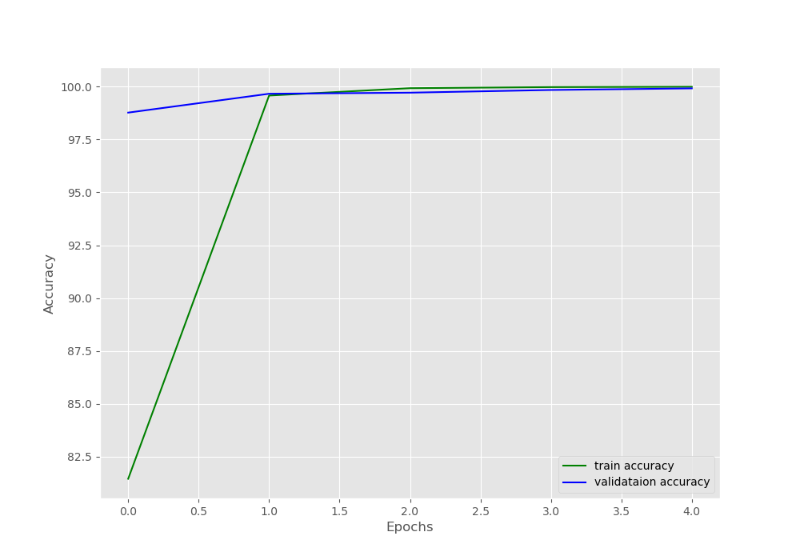
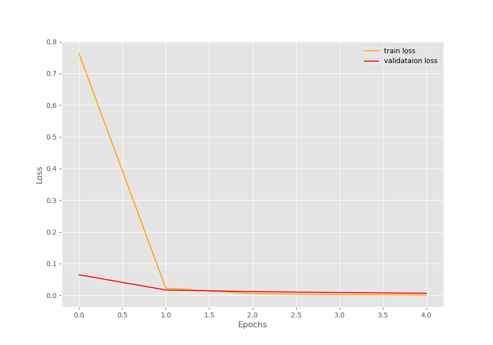

# FYP
## MobileNetV3 from Pytorch model
- Currently import model from pytorch without pre-training it
- Using `German GTSRB dataset` for training
- Manage to train the model (epoch = 25) and validate outcome with CV2
 

## Next step ..

### Pre-process
- GTSRB - class images balancing
- Transform ppm to jpg
- ImageNet - 10 classes
- CiFar

### Implement original model and and modify layers to simulate trigger
- Implement MobileNetV3 without importing it from Pytorch
- Modify layers to study if it will affect the outcome?
- Adaptive learning rate

### Semi-supervised model
- Transfer learning using model trained from above
- Feed in unlabelled images into the model?
- Study the accuracy & loss of the model
- Ratio of unlabled and labeled data
- Effect of trigger on output

<!-- 
<Until wk 12>
------------------------------------------------------------------
    Mobilenet V3
    -Implementation of SL
    -Implementation of SSL ()
    -Backdoor in SL
    -Backdoor in SSL

-------------------------------------------------------------------

 -->